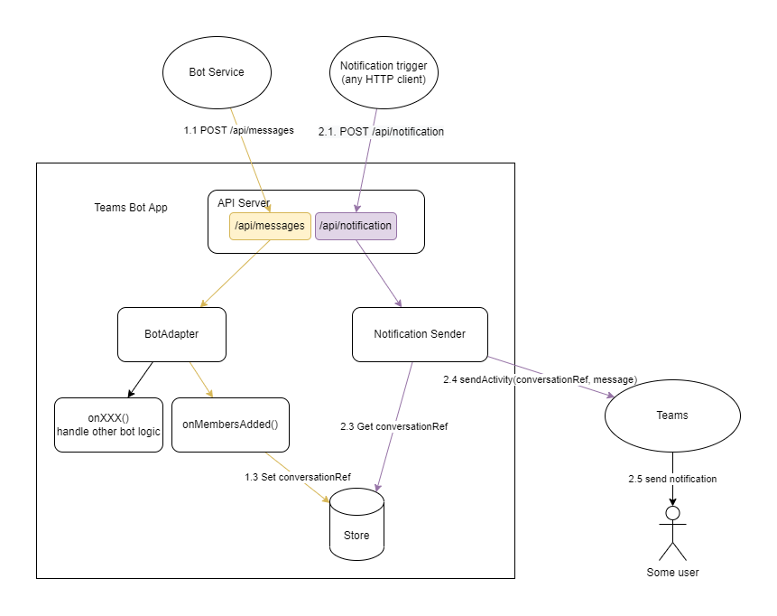

# Sample code for notifying team members

## Support scenarios
The app can be installed to a single team. It can send notifications to single team member in a 1:1 chat from a team by an API trigger.

## Get started
1. Clone this repo and open with Teams toolkit
1. Press F5 to local debug the app and install to a team
1. Run the following command to trigger the notification:

```
curl -X POST http://localhost:3978/api/notification -H 'Content-Type: application/json' -d '{"receiver":"test@example.com","content":"your plain text notification content"}'
```

## Other usage

1. In case the app's conversation reference store is lost, you can reset the conversation reference by send "@BotAppName reset" in a channel that the bot is installed. After this, the bot should work in this team.

## Architecture


